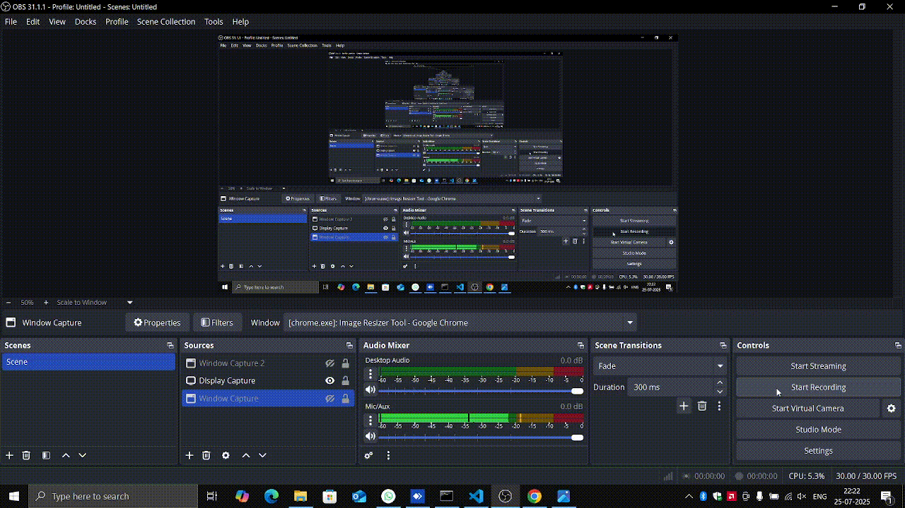

Of course. Here is a `README.md` file that explains your project.

-----

# Image Resizer Tool 🖼️

This is a simple web-based image resizer tool built with **Flask** and **JavaScript**. It allows you to upload images, resize them to a fixed dimension of **800x600 pixels**, and then download the resized image.

## Features ✨

  * **Upload Multiple Images**: You can select and upload multiple images at once.
  * **Image Resizing**: Images are resized to 800x600 pixels using the Pillow library.
  * **Progress Bar**: A progress bar provides feedback during the upload and processing.
  * **Download Resized Image**: After processing, you can download the resized image to your local machine.

-----

## Installation 💻

To run this project locally, you'll need to have Python and pip installed.

1.  **Clone the repository:**

    ```bash
    git clone https://github.com/VP7985/image-resizer.git
    cd image-resizer
    ```

2.  **Create a virtual environment (optional but recommended):**

    ```bash
    python -m venv venv
    source venv/bin/activate  # On Windows, use `venv\Scripts\activate`
    ```

3.  **Install the dependencies:**

    ```bash
    pip install -r requirements.txt
    ```

-----

## Usage 🚀

1.  **Run the Flask application:**

    ```bash
    python app.py
    ```

    The application will be running at `http://127.0.0.1:5000`.

2.  **Open in your browser:**
    Open the URL `http://127.0.0.1:5000` in your web browser.

3.  **Upload an image:**
    Click the **"Upload"** button to select one or more images from your computer.

4.  **Download the resized image:**
    After the upload is complete, click the **"Get"** button to download the resized image.

-----

## Preview 🎥

Here is a quick preview of how the application works:


